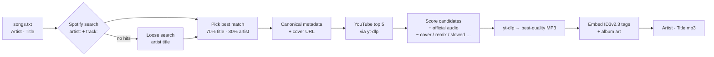
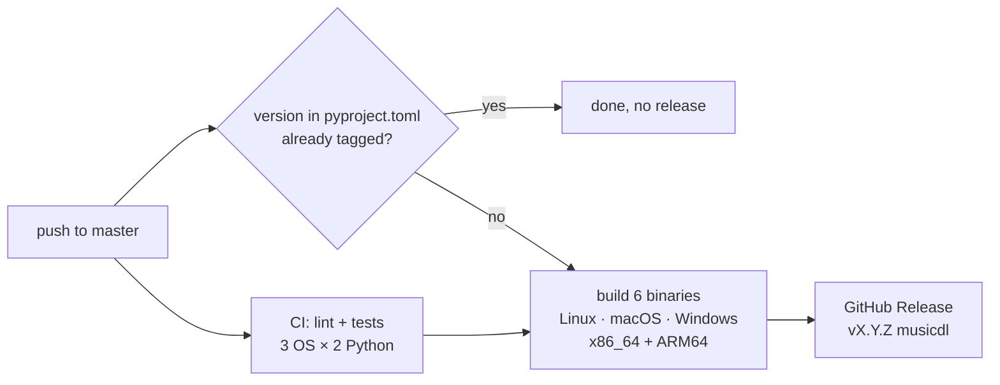

<div align="center">

# 🎵 musicdl

**Turn a plain text list of songs into a library of properly tagged MP3s.**

Spotify supplies the metadata and album art, YouTube supplies the audio. musicdl scores the candidates on both sides to pick the best match.

[](https://github.com/ByteMe6/musicdl/actions/workflows/release.yml)
[](https://github.com/ByteMe6/musicdl/releases/latest)
[](https://www.python.org/)
[](LICENSE)
[](#-installation)

[Features](#-features) •
[Installation](#-installation) •
[Quick start](#-quick-start) •
[Usage](#-usage) •
[How it works](#-how-it-works) •
[FAQ](#-troubleshooting)

</div>

---

```text
$ musicdl songs.txt
Found 3 songs
Already completed: 0
Output: /home/you/Music/musicdl

============================================================
[1/3]
Daft Punk - Harder, Better, Faster, Stronger
Spotify match score: 1.00
Metadata: Daft Punk - Harder, Better, Faster, Stronger
Searching YouTube: Daft Punk Harder, Better, Faster, Stronger
  YouTube score 0.72: Harder, Better, Faster, Stronger (Official Audio)
  YouTube score 0.45: Daft Punk - Harder Better Faster Stronger (Remix)
Selected: Harder, Better, Faster, Stronger (Official Audio)
Spotify cover downloaded
SUCCESS: Daft Punk - Harder, Better, Faster, Stronger.mp3
...
```

## ✨ Features

- **Batch downloads from a text file.** Write one `Artist - Title` per line. Comments and blank lines are allowed.
- **Spotify metadata.** Each file gets the canonical title, every credited artist, album, album artist, track number and release date.
- **Embedded album art.** The highest-resolution Spotify cover is written into the MP3 as the front cover.
- **Scored YouTube matching.** musicdl compares several YouTube results instead of taking the first hit. It prefers official audio and penalises covers, karaoke, nightcore, sped-up and slowed edits, remixes and reaction videos.
- **Best available quality.** yt-dlp extracts the audio as VBR MP3 (`--audio-quality 0`).
- **Resumable runs.** Completed songs go to `done.txt` and are skipped on the next run, so you can stop and restart a 1,000-song list at any point.
- **Failure log.** Every failed song goes to `failed.txt` with the reason, so you can review and retry.
- **Wide player support.** Tags are written as ID3v2.3, which Windows Explorer, iTunes/Music, Android, car stereos and most other players read.
- **Unicode-aware.** Cyrillic and other non-Latin titles are normalised for matching and kept in filenames.
- **Safe filenames.** Characters that are illegal on Windows, macOS or Linux are replaced, and long names are truncated.
- **Standalone binaries.** Prebuilt executables for Linux, macOS and Windows, each on x86_64 and ARM64, are attached to every release.

## 📦 Installation

### Prerequisites

| Requirement | Why | Install |
| --- | --- | --- |
| **Python 3.10+** | Not needed for the prebuilt binary | [python.org](https://www.python.org/downloads/) |
| **[yt-dlp](https://github.com/yt-dlp/yt-dlp)** (recent) | YouTube search and download | `pipx install yt-dlp` / `brew install yt-dlp` / `winget install yt-dlp` |
| **[FFmpeg](https://ffmpeg.org/)** | Audio extraction and MP3 encoding | `apt install ffmpeg` / `brew install ffmpeg` / `winget install ffmpeg` |
| **[Deno](https://deno.com/)** | JavaScript runtime that yt-dlp needs for YouTube | `curl -fsSL https://deno.land/install.sh \| sh` / `brew install deno` / `winget install DenoLand.Deno` |
| **Spotify API credentials** | Metadata and cover art | See [Spotify credentials](#-spotify-credentials) |

> [!NOTE]
> `yt-dlp`, `ffmpeg` and `deno` must be on your `PATH`. musicdl calls the `yt-dlp` executable directly.

### Option 1: pipx (recommended)

```bash
pipx install git+https://github.com/ByteMe6/musicdl.git
```

### Option 2: prebuilt binary

Download the executable for your platform from the [latest release](https://github.com/ByteMe6/musicdl/releases/latest):

| OS | x86_64 | ARM64 |
| --- | --- | --- |
| 🐧 Linux | [`musicdl-linux-x86_64`](https://github.com/ByteMe6/musicdl/releases/latest/download/musicdl-linux-x86_64) | [`musicdl-linux-arm64`](https://github.com/ByteMe6/musicdl/releases/latest/download/musicdl-linux-arm64) |
| 🍎 macOS | [`musicdl-macos-x86_64`](https://github.com/ByteMe6/musicdl/releases/latest/download/musicdl-macos-x86_64) | [`musicdl-macos-arm64`](https://github.com/ByteMe6/musicdl/releases/latest/download/musicdl-macos-arm64) |
| 🪟 Windows | [`musicdl-windows-x86_64.exe`](https://github.com/ByteMe6/musicdl/releases/latest/download/musicdl-windows-x86_64.exe) | [`musicdl-windows-arm64.exe`](https://github.com/ByteMe6/musicdl/releases/latest/download/musicdl-windows-arm64.exe) |

On Linux and macOS, make it executable and put it on your `PATH`:

```bash
chmod +x musicdl-linux-x86_64
sudo mv musicdl-linux-x86_64 /usr/local/bin/musicdl
```

> [!TIP]
> On macOS, if Gatekeeper blocks the unsigned binary, run `xattr -d com.apple.quarantine musicdl-macos-*` once.

### Option 3: from source

```bash
git clone https://github.com/ByteMe6/musicdl.git
cd musicdl
python -m venv .venv && source .venv/bin/activate
pip install -r requirements.txt
python musicdl.py --help
```

## 🔑 Spotify credentials

musicdl uses Spotify's **Client Credentials** flow. No Spotify login or user permissions are involved.

1. Open the [Spotify Developer Dashboard](https://developer.spotify.com/dashboard) and click **Create app**.
2. Enter any name and description. For the redirect URI, enter `http://127.0.0.1:8888/callback`. It is never used, but the form requires one.
3. Open the app's **Settings** and copy the **Client ID** and **Client Secret**.
4. Export them in your shell:

<details open>
<summary><b>bash / zsh</b></summary>

```bash
export SPOTIFY_CLIENT_ID='your-client-id'
export SPOTIFY_CLIENT_SECRET='your-client-secret'
```
</details>

<details>
<summary><b>fish</b></summary>

```fish
set -Ux SPOTIFY_CLIENT_ID 'your-client-id'
set -Ux SPOTIFY_CLIENT_SECRET 'your-client-secret'
```
</details>

<details>
<summary><b>PowerShell</b></summary>

```powershell
[Environment]::SetEnvironmentVariable('SPOTIFY_CLIENT_ID', 'your-client-id', 'User')
[Environment]::SetEnvironmentVariable('SPOTIFY_CLIENT_SECRET', 'your-client-secret', 'User')
```
</details>

> [!CAUTION]
> Spotipy caches the access token in a `.cache` file in the current directory. It is already listed in `.gitignore`. Never commit it.

## 🚀 Quick start

```bash
cat > songs.txt <<'EOF'
# My playlist
Daft Punk - Harder, Better, Faster, Stronger
Radiohead - Paranoid Android
Korol i Shut - Мёртвый Анархист
EOF

musicdl songs.txt
```

Your files are written to `~/Music/musicdl/`.

## 🛠 Usage

```text
musicdl [-h] [-o OUTPUT] [--title-only] [--delay DELAY] input
```

| Argument | Default | Description |
| --- | --- | --- |
| `input` | *required* | Text file with one `Artist - Title` per line |
| `-o`, `--output` | `~/Music/musicdl` | Output directory. It is created if missing. |
| `--title-only` | off | Name files `Title.mp3` instead of `Artist - Title.mp3` |
| `--delay` | `1.0` | Seconds to wait between songs. Raise it for large lists. |

### Examples

```bash
# Download to a custom folder
musicdl songs.txt -o ~/Music/RoadTrip

# Short filenames for a car stereo or USB stick
musicdl songs.txt -o /media/usb --title-only

# Go easy on rate limits for a huge list
musicdl big-list.txt --delay 3
```

### Input format

```text
# Lines starting with "#" are comments
Artist - Title
Artist feat. Someone - Title - Live Version   ← the first " - " is the separator
```

- The separator is **space, hyphen, space** (` - `). Only the first one counts, so titles may contain ` - `.
- Blank lines and `#` comments are ignored. Lines without a separator are skipped.
- See [`examples/songs.txt`](examples/songs.txt) for a ready-to-run sample.

### Output directory

```text
~/Music/musicdl/
├── Daft Punk - Harder, Better, Faster, Stronger.mp3
├── Radiohead - Paranoid Android.mp3
├── done.txt      ← songs that finished; skipped on later runs
└── failed.txt    ← "Artist - Title | reason" for anything that failed
```

To **retry failures**, strip the reasons from `failed.txt` and feed it back in:

```bash
cut -d'|' -f1 ~/Music/musicdl/failed.txt | sed 's/ *$//' > retry.txt
musicdl retry.txt
```

To **force a re-download**, delete the song's line from `done.txt` and delete its MP3.

## 🧠 How it works



1. **Resolve the song on Spotify.** musicdl runs a strict `artist:"…" track:"…"` search and falls back to a loose search if nothing comes back. Each candidate gets a fuzzy-similarity score (70% title, 30% artist), and the best one supplies the official spelling, the full artist credits, the album data and the cover.
2. **Find the audio on YouTube.** musicdl fetches the top 5 results for the *canonical* artist and title and scores each one:

   | Signal | Effect |
   | --- | --- |
   | Title similarity | × 0.70 |
   | Artist similarity | × 0.30 |
   | `official audio` in the video title | +0.08 |
   | `audio` in the video title | +0.03 |
   | `cover`, `karaoke`, `караоке`, `nightcore`, `sped up`, `slowed`, `remix`, `reaction` | −0.20 each |

3. **Download.** yt-dlp downloads only the winning video and converts it to the highest-quality MP3.
4. **Tag.** musicdl writes the following frames, replacing any existing ones:

   | Frame | Content |
   | --- | --- |
   | `TIT2` | Title |
   | `TPE1` | Artist(s) |
   | `TALB` | Album |
   | `TPE2` | Album artist |
   | `TRCK` | Track number |
   | `TDRC` | Release date |
   | `APIC` | Front cover (Spotify, up to 640×640) |

If Spotify has no match, the song is still downloaded and tagged with the artist and title from your input file.

## 🧩 Building a standalone binary

```bash
pip install -r requirements.txt pyinstaller
pyinstaller musicdl.spec
./dist/musicdl --help
```

## 🚢 Releasing

Releases are fully automated by the [Build & Release](.github/workflows/release.yml) workflow:



To cut a new release:

1. Bump `version` in [`pyproject.toml`](pyproject.toml).
2. Add a `## [X.Y.Z] - YYYY-MM-DD` section to [`CHANGELOG.md`](CHANGELOG.md). It becomes the release notes.
3. Push to `master`.

Pushes that don't change the version only run CI.

## 🩺 Troubleshooting

<details>
<summary><b><code>ERROR: Spotify credentials not found.</code></b></summary>

`SPOTIFY_CLIENT_ID` and `SPOTIFY_CLIENT_SECRET` aren't set in the current shell. See [Spotify credentials](#-spotify-credentials).
</details>

<details>
<summary><b><code>yt-dlp download failed</code> / <code>No YouTube result</code> for every song</b></summary>

YouTube changes often, so update yt-dlp first: `pipx upgrade yt-dlp` or `yt-dlp -U`. Recent yt-dlp versions also need a JavaScript runtime. Install [Deno](https://deno.com/) and make sure it's on your `PATH`.
</details>

<details>
<summary><b><code>ERROR: Postprocessing: ffprobe and ffmpeg not found</code></b></summary>

Install FFmpeg and check that `ffmpeg -version` works in the same terminal.
</details>

<details>
<summary><b>The wrong version of a song was downloaded</b></summary>

Make the input line more specific, for example by using the exact Spotify spelling of the title. Then delete the MP3 and its line in `done.txt` and run musicdl again.
</details>

<details>
<summary><b>HTTP 429 / rate limiting</b></summary>

Increase `--delay`, for example `--delay 3`. Interrupted runs resume where they stopped.
</details>

## 🤝 Contributing

Issues and pull requests are welcome.

```bash
git clone https://github.com/ByteMe6/musicdl.git && cd musicdl
python -m venv .venv && source .venv/bin/activate
pip install -r requirements.txt ruff
ruff check .
```

Please keep pull requests focused, and describe what you changed and why.

## ⚖️ Disclaimer

This tool is for **personal use** with content you have the right to download. You are responsible for complying with copyright law in your country and with the Terms of Service of YouTube and Spotify. musicdl is not affiliated with, endorsed by or sponsored by Spotify or YouTube. If you can, support the artists you listen to.

## 📄 License

[MIT](LICENSE) © ByteMe6
