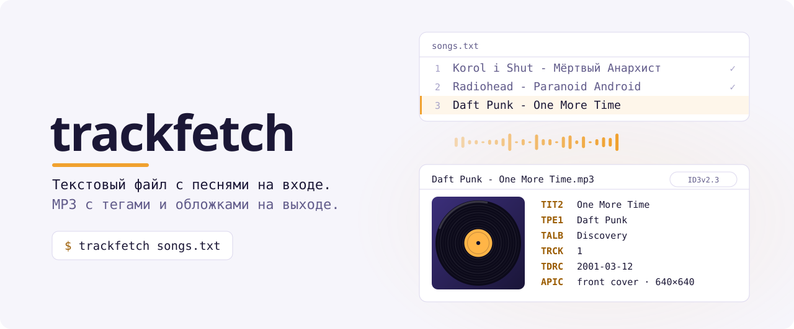

<picture>
  <source media="(prefers-color-scheme: dark)" srcset=".github/assets/banner-dark.ru.svg">
  
</picture>

<p align="center">
  <a href="https://github.com/ByteMe6/trackfetch/releases/latest"></a>
  <a href="https://pypi.org/project/trackfetch/"></a>
  <a href="https://github.com/ByteMe6/trackfetch/actions/workflows/release.yml"></a>
  <a href="#установка"></a>
  <a href="#готовый-бинарник"></a>
  <a href="LICENSE"></a>
</p>

<p align="center">
  <a href="README.md">English</a> · <a href="README.uk.md">Українська</a> · <b>Русский</b>
</p>

<p align="center">
  <a href="#установка">Установка</a> ·
  <a href="#быстрый-старт">Быстрый старт</a> ·
  <a href="#плейлисты-из-стриминговых-сервисов">Плейлисты из стримингов</a> ·
  <a href="#использование">Использование</a> ·
  <a href="#как-это-работает">Как это работает</a> ·
  <a href="#решение-проблем">Решение проблем</a>
</p>

<br>



<br>

trackfetch читает обычный текстовый файл, где на каждой строке записано `Исполнитель - Название`. Для каждой песни он берёт официальные метаданные и обложку из Spotify, выбирает самое подходящее аудио на YouTube и сохраняет MP3 с полными ID3-тегами. Работу можно прервать в любой момент и продолжить позже, даже если в списке тысяча песен.

- **Точные метаданные.** Название, все исполнители, альбом, исполнитель альбома, номер трека и дата выхода берутся из Spotify, а не из названия ролика на YouTube.
- **Обложка альбома.** В каждый файл встраивается обложка из Spotify в самом большом размере.
- **Правильная загрузка.** trackfetch оценивает пять результатов YouTube на каждую песню. Официальное аудио выигрывает, а каверы, караоке, nightcore, ускоренные, замедленные версии, ремиксы и реакции проигрывают.
- **Лучшее качество.** yt-dlp извлекает звук в MP3 VBR максимального качества.
- **Продолжение с места остановки.** Готовые песни записываются в `done.txt` и при следующем запуске пропускаются. Ошибки попадают в `failed.txt` вместе с причиной.
- **Играет везде.** Теги записываются в формате ID3v2.3, который понимают Проводник Windows, Apple Music, Android, автомагнитолы и большинство плееров.
- **Любой алфавит.** Кириллица и другие нелатинские названия правильно сопоставляются и сохраняются в именах файлов. Символы, запрещённые в именах файлов, заменяются.
- **Python не нужен.** Готовые бинарники для Linux, macOS и Windows на x86_64 и ARM64.

## Установка

Выбери любой способ. Homebrew и Nix сами ставят yt-dlp, FFmpeg и Deno; при остальных способах их нужно поставить отдельно ([см. ниже](#зависимости)). Для любого способа нужен бесплатный ключ Spotify API ([как его получить](#ключи-spotify)).

### Homebrew

macOS и Linux:

```bash
brew install ByteMe6/tap/trackfetch
```

На Intel-Mac Homebrew собирает зависимости из исходников, поэтому первая установка займёт время.

### Nix

Linux и Mac на Apple Silicon, с включёнными flakes:

```bash
nix run github:ByteMe6/trackfetch -- songs.txt   # запустить без установки
nix profile install github:ByteMe6/trackfetch    # установить
```

### pipx

```bash
pipx install trackfetch
```

### Готовый бинарник

Python не нужен. Скачай файл для своей системы из [последнего релиза](https://github.com/ByteMe6/trackfetch/releases/latest):

| | x86_64 | ARM64 |
| --- | --- | --- |
| **Linux** | [`trackfetch-linux-x86_64`](https://github.com/ByteMe6/trackfetch/releases/latest/download/trackfetch-linux-x86_64) | [`trackfetch-linux-arm64`](https://github.com/ByteMe6/trackfetch/releases/latest/download/trackfetch-linux-arm64) |
| **macOS** | [`trackfetch-macos-x86_64`](https://github.com/ByteMe6/trackfetch/releases/latest/download/trackfetch-macos-x86_64) (Intel) | [`trackfetch-macos-arm64`](https://github.com/ByteMe6/trackfetch/releases/latest/download/trackfetch-macos-arm64) (Apple Silicon) |
| **Windows** | [`trackfetch-windows-x86_64.exe`](https://github.com/ByteMe6/trackfetch/releases/latest/download/trackfetch-windows-x86_64.exe) | [`trackfetch-windows-arm64.exe`](https://github.com/ByteMe6/trackfetch/releases/latest/download/trackfetch-windows-arm64.exe) |

На Linux и macOS сделай файл исполняемым и положи его в `PATH`:

```bash
chmod +x trackfetch-linux-x86_64
sudo mv trackfetch-linux-x86_64 /usr/local/bin/trackfetch
```

Если на macOS Gatekeeper блокирует неподписанный бинарник, один раз выполни `xattr -d com.apple.quarantine trackfetch-macos-*`. Контрольные суммы лежат в `SHA256SUMS.txt` в каждом релизе.

### Из исходников

```bash
git clone https://github.com/ByteMe6/trackfetch.git
cd trackfetch
python -m venv .venv && source .venv/bin/activate
pip install -e .
```

### Зависимости

При установке через pipx, готовым бинарником или из исходников эти программы должны быть в `PATH`:

| Программа | Зачем | Установка |
| --- | --- | --- |
| [yt-dlp](https://github.com/yt-dlp/yt-dlp) | Поиск и загрузка с YouTube | `pipx install yt-dlp` · `brew install yt-dlp` · `winget install yt-dlp` |
| [FFmpeg](https://ffmpeg.org/) | Конвертация звука в MP3 | `sudo apt install ffmpeg` · `brew install ffmpeg` · `winget install ffmpeg` |
| [Deno](https://deno.com/) | Среда JavaScript, без которой yt-dlp не работает с YouTube | `curl -fsSL https://deno.land/install.sh \| sh` · `brew install deno` · `winget install DenoLand.Deno` |

## Ключи Spotify

trackfetch использует в Spotify режим Client Credentials: входить в аккаунт не нужно, доступа к твоему профилю у программы нет.

1. Открой [Spotify Developer Dashboard](https://developer.spotify.com/dashboard) и нажми **Create app**.
2. Введи любое название и описание. В поле Redirect URI укажи `http://127.0.0.1:8888/callback`. trackfetch его не использует, но без него форма не сохраняется.
3. Открой **Settings** приложения и скопируй **Client ID** и **Client Secret**.
4. Задай их как переменные окружения:

<details open>
<summary><b>bash / zsh</b></summary>

```bash
export SPOTIFY_CLIENT_ID='твой-client-id'
export SPOTIFY_CLIENT_SECRET='твой-client-secret'
```

</details>

<details>
<summary><b>fish</b></summary>

```fish
set -Ux SPOTIFY_CLIENT_ID 'твой-client-id'
set -Ux SPOTIFY_CLIENT_SECRET 'твой-client-secret'
```

</details>

<details>
<summary><b>PowerShell</b></summary>

```powershell
[Environment]::SetEnvironmentVariable('SPOTIFY_CLIENT_ID', 'твой-client-id', 'User')
[Environment]::SetEnvironmentVariable('SPOTIFY_CLIENT_SECRET', 'твой-client-secret', 'User')
```

</details>

> [!CAUTION]
> Spotipy сохраняет токен доступа в файл `.cache` в текущей папке. Не коммить его и никому не передавай.

## Быстрый старт

```bash
cat > songs.txt <<'EOF'
# Мой плейлист
Daft Punk - One More Time
Radiohead - Paranoid Android
Korol i Shut - Мёртвый Анархист
EOF

trackfetch songs.txt
```

Файлы появятся в `~/Music/trackfetch/`.

## Плейлисты из стриминговых сервисов

Список не обязательно набирать вручную. [TuneMyMusic](https://www.tunemymusic.com/) экспортирует плейлисты из Spotify, Apple Music, YouTube Music, Deezer, Tidal, SoundCloud и других сервисов в текстовый файл, который trackfetch читает без всякой доработки:

1. На [tunemymusic.com](https://www.tunemymusic.com/) выбери в качестве источника сервис, где лежит твой плейлист.
2. Отметь нужные плейлисты.
3. В качестве назначения выбери **Export to file** и сохрани в формате **TXT**.
4. Запусти trackfetch на полученном файле:

```bash
trackfetch "My Playlist.txt" -o ~/Music/"My Playlist"
```

## Использование

```text
trackfetch [-h] [-o OUTPUT] [--title-only] [--delay DELAY] input
```

| Параметр | По умолчанию | Что делает |
| --- | --- | --- |
| `input` | обязательный | Текстовый файл, где на каждой строке `Исполнитель - Название` |
| `-o`, `--output` | `~/Music/trackfetch` | Папка для MP3. Если её нет, она будет создана. |
| `--title-only` | выключен | Называть файлы `Название.mp3` вместо `Исполнитель - Название.mp3` |
| `--delay` | `1.0` | Пауза между песнями в секундах. Для длинных списков её стоит увеличить. |

```bash
trackfetch songs.txt -o ~/Music/RoadTrip          # сохранить в конкретную папку
trackfetch songs.txt -o /media/usb --title-only   # короткие имена для автомагнитолы
trackfetch big-list.txt --delay 3                 # бережнее к лимитам запросов
```

### Входной файл

```text
# Строки, начинающиеся с "#", — комментарии. Пустые строки пропускаются.
Daft Punk - One More Time
Sufjan Stevens - Mystery of Love - Remastered   ← исполнителя и название разделяет только первый " - "
```

Разделитель: пробел, дефис, пробел (` - `). Строки без разделителя пропускаются. Пример: [`examples/songs.txt`](examples/songs.txt).

### Папка с результатами

```text
~/Music/trackfetch/
├── Daft Punk - One More Time.mp3
├── Radiohead - Paranoid Android.mp3
├── done.txt      ← готовые песни, при следующем запуске пропускаются
└── failed.txt    ← "Исполнитель - Название | причина" для каждой неудачной песни
```

**Повторить неудачные:** убери причины из `failed.txt` и запусти ещё раз:

```bash
cut -d '|' -f 1 ~/Music/trackfetch/failed.txt > retry.txt
trackfetch retry.txt
```

**Скачать песню заново:** удали её MP3 и её строку в `done.txt`.

### Шпаргалка

Страница для [tldr](https://tldr.sh/) лежит в [`docs/tldr/trackfetch.md`](docs/tldr/trackfetch.md). Чтобы пользоваться ей в [tealdeer](https://github.com/tealdeer-rs/tealdeer), скопируй её в папку пользовательских страниц под именем `trackfetch.page.md`.

## Как это работает

1. **Поиск песни в Spotify.** trackfetch ищет `artist:"…" track:"…"`, а если ничего не нашлось, делает менее строгий поиск. Каждый результат оценивается по нечёткому сходству: 70% даёт название, 30% исполнитель. Лучший результат даёт официальное написание, всех исполнителей, данные альбома и обложку.
2. **Поиск аудио на YouTube.** trackfetch ищет на YouTube официальные исполнителя и название и оценивает первые пять результатов:

   | Признак | Влияние на оценку |
   | --- | --- |
   | Сходство с названием песни | × 0.70 |
   | Сходство с исполнителем | × 0.30 |
   | `official audio` в названии ролика | +0.08 |
   | `audio` в названии ролика | +0.03 |
   | `cover`, `karaoke`, `караоке`, `nightcore`, `sped up`, `slowed`, `remix`, `reaction` | −0.20 за каждое |

3. **Загрузка.** yt-dlp скачивает только победивший ролик и конвертирует его в MP3.
4. **Теги.** trackfetch заменяет все существующие теги этими фреймами ID3v2.3:

   | Фрейм | Содержимое |
   | --- | --- |
   | `TIT2` | Название |
   | `TPE1` | Исполнители |
   | `TALB` | Альбом |
   | `TPE2` | Исполнитель альбома |
   | `TRCK` | Номер трека |
   | `TDRC` | Дата выхода |
   | `APIC` | Обложка, до 640×640 |

Если в Spotify песня не нашлась, она всё равно скачивается и получает теги с исполнителем и названием из твоего файла.

## Решение проблем

<details>
<summary><b><code>ERROR: Spotify credentials not found.</code></b></summary>

В этом терминале не заданы `SPOTIFY_CLIENT_ID` и `SPOTIFY_CLIENT_SECRET`. См. [Ключи Spotify](#ключи-spotify).

</details>

<details>
<summary><b>Все песни падают с <code>no YouTube result</code> или <code>yt-dlp download failed</code></b></summary>

YouTube часто меняется. Сначала обнови yt-dlp: `pipx upgrade yt-dlp` или `yt-dlp -U`. Новым версиям yt-dlp также нужен Deno: проверь, что `deno --version` работает в том же терминале.

</details>

<details>
<summary><b><code>ERROR: Postprocessing: ffprobe and ffmpeg not found</code></b></summary>

Установи FFmpeg и проверь, что `ffmpeg -version` работает в том же терминале.

</details>

<details>
<summary><b>Скачалась не та версия песни</b></summary>

Уточни строку в файле, например напиши название точно так, как оно записано в Spotify. Затем удали MP3 и его строку в `done.txt` и запусти trackfetch снова. Если программа продолжает выбирать не тот ролик, [создай issue](https://github.com/ByteMe6/trackfetch/issues/new?template=bug_report.yml) и приложи строки `YouTube score` из вывода.

</details>

<details>
<summary><b>HTTP 429 и другие ошибки лимита запросов</b></summary>

Увеличь `--delay`, например до `3`. Прерванный запуск продолжится с того места, где остановился.

</details>

## Разработка

```bash
pip install -e ".[test]" ruff
ruff check .
pytest --cov=trackfetch
```

Тесты подменяют все сетевые запросы и внешние процессы, поэтому работают без интернета меньше чем за секунду. Чтобы собрать бинарник самому, выполни `pip install pyinstaller && pyinstaller trackfetch.spec`; результат появится в `dist/`.

Перед pull request прочитай [CONTRIBUTING.md](CONTRIBUTING.md) (на английском).

### Релизы

Каждый push в `master` запускает тесты на Linux, macOS и Windows. Если для `version` из [`pyproject.toml`](pyproject.toml) ещё нет тега `vX.Y.Z`, workflow [Build & Release](.github/workflows/release.yml) дополнительно собирает все шесть бинарников и публикует релиз. Описанием релиза становится раздел этой версии из [`CHANGELOG.md`](CHANGELOG.md).

Чтобы выпустить релиз, перенеси изменения из `[Unreleased]` в новый раздел `## [X.Y.Z] - ГГГГ-ММ-ДД`, подними `version` и сделай push.

> [!IMPORTANT]
> Поднимай версию в коммите, который не меняет `.github/workflows/`. GitHub не разрешает токену workflow ставить тег на коммит с изменёнными workflow-файлами, и публикация релиза упадёт с ошибкой 403.

## Отказ от ответственности

trackfetch предназначен для личного использования и только для контента, который ты вправе скачивать. Ты сам отвечаешь за соблюдение авторского права в своей стране и условий использования YouTube и Spotify. trackfetch не связан со Spotify, YouTube и TuneMyMusic и не одобрен ими. Если есть возможность, поддерживай артистов, которых слушаешь.

## Лицензия

trackfetch — свободное программное обеспечение под лицензией [GNU General Public License v3.0 или более поздней версии](LICENSE). Его можно использовать, изучать, изменять и распространять. Изменённые версии при распространении должны оставаться под той же лицензией.
