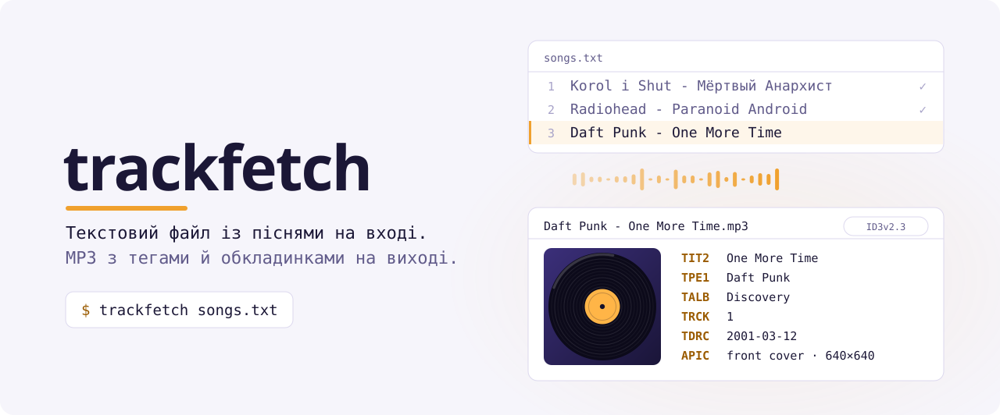

<picture>
  <source media="(prefers-color-scheme: dark)" srcset=".github/assets/banner-dark.uk.svg">
  
</picture>

<p align="center">
  <a href="https://github.com/ByteMe6/trackfetch/releases/latest"></a>
  <a href="https://pypi.org/project/trackfetch/"></a>
  <a href="https://github.com/ByteMe6/trackfetch/actions/workflows/release.yml"></a>
  <a href="#встановлення"></a>
  <a href="#готовий-бінарний-файл"></a>
  <a href="LICENSE"></a>
</p>

<p align="center">
  <a href="README.md">English</a> · <b>Українська</b> · <a href="README.ru.md">Русский</a>
</p>

<p align="center">
  <a href="#встановлення">Встановлення</a> ·
  <a href="#швидкий-старт">Швидкий старт</a> ·
  <a href="#плейлисти-зі-стрімінгових-сервісів">Плейлисти зі стрімінгів</a> ·
  <a href="#використання">Використання</a> ·
  <a href="#як-це-працює">Як це працює</a> ·
  <a href="#усунення-несправностей">Усунення несправностей</a>
</p>

<br>


<br>

trackfetch читає звичайний текстовий файл, де в кожному рядку записано `Виконавець - Назва`. Для кожної пісні він бере офіційні метадані й обкладинку зі Spotify, обирає найвідповідніше аудіо на YouTube і зберігає MP3 з повними ID3-тегами. Роботу можна перервати будь-коли й продовжити пізніше, навіть якщо у списку тисяча пісень.

- **Точні метадані.** Назва, усі виконавці, альбом, виконавець альбому, номер треку й дата виходу беруться зі Spotify, а не з назви ролика на YouTube.
- **Обкладинка альбому.** У кожен файл вбудовується обкладинка зі Spotify у найбільшому розмірі.
- **Правильне завантаження.** trackfetch оцінює п'ять результатів YouTube для кожної пісні. Офіційне аудіо виграє, а кавери, караоке, nightcore, прискорені, сповільнені версії, ремікси й реакції програють.
- **Формат на вибір.** MP3 для будь-якого плеєра або Opus і M4A, які зберігають оригінальний звук YouTube без перекодування.
- **Продовження з місця зупинки.** Готові пісні записуються в `done.txt` і під час наступного запуску пропускаються. Помилки потрапляють у `failed.txt` разом із причиною.
- **Грає всюди.** Теги записуються у форматі ID3v2.3, який розуміють Провідник Windows, Apple Music, Android, автомагнітоли й більшість плеєрів.
- **Будь-яка абетка.** Кирилиця та інші нелатинські назви правильно зіставляються й зберігаються в іменах файлів. Символи, заборонені в іменах файлів, замінюються.
- **Python не потрібен.** Готові бінарні файли для Linux, macOS і Windows на x86_64 та ARM64.

## Встановлення

Обери будь-який спосіб. Homebrew і Nix самі встановлюють yt-dlp, FFmpeg і Deno; для інших способів їх треба встановити окремо ([див. нижче](#залежності)). Для будь-якого способу потрібен безкоштовний ключ Spotify API ([як його отримати](#ключі-spotify)).

### Homebrew

macOS і Linux:

```bash
brew install ByteMe6/tap/trackfetch
```

На Intel-Mac Homebrew збирає залежності з вихідного коду, тому перше встановлення триватиме довго.

### Nix

Linux і Mac на Apple Silicon, з увімкненими flakes:

```bash
nix run github:ByteMe6/trackfetch -- songs.txt   # запустити без встановлення
nix profile install github:ByteMe6/trackfetch    # встановити
```

### pipx

```bash
pipx install trackfetch
```

### Готовий бінарний файл

Python не потрібен. Завантаж файл для своєї системи з [останнього релізу](https://github.com/ByteMe6/trackfetch/releases/latest):

| | x86_64 | ARM64 |
| --- | --- | --- |
| **Linux** | [`trackfetch-linux-x86_64`](https://github.com/ByteMe6/trackfetch/releases/latest/download/trackfetch-linux-x86_64) | [`trackfetch-linux-arm64`](https://github.com/ByteMe6/trackfetch/releases/latest/download/trackfetch-linux-arm64) |
| **macOS** | [`trackfetch-macos-x86_64`](https://github.com/ByteMe6/trackfetch/releases/latest/download/trackfetch-macos-x86_64) (Intel) | [`trackfetch-macos-arm64`](https://github.com/ByteMe6/trackfetch/releases/latest/download/trackfetch-macos-arm64) (Apple Silicon) |
| **Windows** | [`trackfetch-windows-x86_64.exe`](https://github.com/ByteMe6/trackfetch/releases/latest/download/trackfetch-windows-x86_64.exe) | [`trackfetch-windows-arm64.exe`](https://github.com/ByteMe6/trackfetch/releases/latest/download/trackfetch-windows-arm64.exe) |

На Linux і macOS зроби файл виконуваним і поклади його в `PATH`:

```bash
chmod +x trackfetch-linux-x86_64
sudo mv trackfetch-linux-x86_64 /usr/local/bin/trackfetch
```

Якщо на macOS Gatekeeper блокує непідписаний файл, один раз виконай `xattr -d com.apple.quarantine trackfetch-macos-*`. Контрольні суми є у `SHA256SUMS.txt` у кожному релізі.

### З вихідного коду

```bash
git clone https://github.com/ByteMe6/trackfetch.git
cd trackfetch
python -m venv .venv && source .venv/bin/activate
pip install -e .
```

### Залежності

Під час встановлення через pipx, готовим бінарним файлом або з вихідного коду ці програми мають бути в `PATH`:

| Програма | Навіщо | Встановлення |
| --- | --- | --- |
| [yt-dlp](https://github.com/yt-dlp/yt-dlp) | Пошук і завантаження з YouTube | `pipx install yt-dlp` · `brew install yt-dlp` · `winget install yt-dlp` |
| [FFmpeg](https://ffmpeg.org/) | Конвертація звуку в MP3 | `sudo apt install ffmpeg` · `brew install ffmpeg` · `winget install ffmpeg` |
| [Deno](https://deno.com/) | Середовище JavaScript, без якого yt-dlp не працює з YouTube | `curl -fsSL https://deno.land/install.sh \| sh` · `brew install deno` · `winget install DenoLand.Deno` |

## Ключі Spotify

trackfetch використовує у Spotify режим Client Credentials: входити в акаунт не потрібно, доступу до твого профілю програма не має.

1. Відкрий [Spotify Developer Dashboard](https://developer.spotify.com/dashboard) і натисни **Create app**.
2. Введи будь-яку назву й опис. У полі Redirect URI вкажи `http://127.0.0.1:8888/callback`. trackfetch його не використовує, але без нього форма не зберігається.
3. Відкрий **Settings** застосунку й скопіюй **Client ID** та **Client Secret**.
4. Задай їх як змінні середовища:

<details open>
<summary><b>bash / zsh</b></summary>

```bash
export SPOTIFY_CLIENT_ID='твій-client-id'
export SPOTIFY_CLIENT_SECRET='твій-client-secret'
```

</details>

<details>
<summary><b>fish</b></summary>

```fish
set -Ux SPOTIFY_CLIENT_ID 'твій-client-id'
set -Ux SPOTIFY_CLIENT_SECRET 'твій-client-secret'
```

</details>

<details>
<summary><b>PowerShell</b></summary>

```powershell
[Environment]::SetEnvironmentVariable('SPOTIFY_CLIENT_ID', 'твій-client-id', 'User')
[Environment]::SetEnvironmentVariable('SPOTIFY_CLIENT_SECRET', 'твій-client-secret', 'User')
```

</details>

> [!CAUTION]
> Spotipy зберігає токен доступу у файл `.cache` у поточній теці. Не коміть його й нікому не передавай.

## Швидкий старт

```bash
cat > songs.txt <<'EOF'
# Мій плейлист
Daft Punk - One More Time
Radiohead - Paranoid Android
Korol i Shut - Мёртвый Анархист
EOF

trackfetch songs.txt
```

Файли з'являться в `~/Music/trackfetch/`.

## Плейлисти зі стрімінгових сервісів

Список не обов'язково набирати вручну. [TuneMyMusic](https://www.tunemymusic.com/) експортує плейлисти зі Spotify, Apple Music, YouTube Music, Deezer, Tidal, SoundCloud та інших сервісів у текстовий файл, який trackfetch читає без жодних змін:

1. На [tunemymusic.com](https://www.tunemymusic.com/) обери джерелом сервіс, де лежить твій плейлист.
2. Познач потрібні плейлисти.
3. Як призначення обери **Export to file** і збережи у форматі **TXT**.
4. Запусти trackfetch на отриманому файлі:

```bash
trackfetch "My Playlist.txt" -o ~/Music/"My Playlist"
```

## Використання

```text
trackfetch [-h] [-o OUTPUT] [-f {mp3,m4a,opus}] [--title-only] [--delay DELAY] input
```

| Параметр | За замовчуванням | Що робить |
| --- | --- | --- |
| `input` | обов'язковий | Текстовий файл, де в кожному рядку `Виконавець - Назва` |
| `-o`, `--output` | `~/Music/trackfetch` | Тека для файлів. Якщо її немає, вона буде створена. |
| `-f`, `--format` | `mp3` | Формат звуку: `mp3`, `m4a` або `opus`. Див. [Формати звуку](#формати-звуку). |
| `--title-only` | вимкнено | Називати файли `Назва.mp3` замість `Виконавець - Назва.mp3` |
| `--delay` | `1.0` | Пауза між піснями в секундах. Для довгих списків її варто збільшити. |

```bash
trackfetch songs.txt -o ~/Music/RoadTrip          # зберегти в конкретну теку
trackfetch songs.txt -o /media/usb --title-only   # короткі імена для автомагнітоли
trackfetch big-list.txt --delay 3                 # дбайливіше до лімітів запитів
trackfetch songs.txt --format opus                # оригінальний звук YouTube без перекодування
```

### Формати звуку

| Формат | Що отримуєш | Де грає |
| --- | --- | --- |
| `mp3` (за замовчуванням) | Звук YouTube, **перекодований** у MP3 VBR максимальної якості. Це повторне стиснення з втратами, тому трохи гірше за оригінал | усюди, зокрема старі плеєри й автомагнітоли |
| `opus` | **Оригінальний** звук YouTube в Opus, скопійований без перекодування. Найкраща доступна якість | більшість сучасних плеєрів, Android, браузери; не iTunes і не старі пристрої |
| `m4a` | **Оригінальний** звук YouTube в AAC, якщо він є, скопійований без перекодування | пристрої Apple, iTunes, більшість плеєрів |

У всіх трьох форматах однакові теги й вбудована обкладинка. `done.txt` не враховує формат, тому для кожного формату вказуй окрему теку `-o`.

### Вхідний файл

```text
# Рядки, що починаються з "#", — коментарі. Порожні рядки пропускаються.
Daft Punk - One More Time
Sufjan Stevens - Mystery of Love - Remastered   ← виконавця й назву розділяє лише перший " - "
```

Роздільник: пробіл, дефіс, пробіл (` - `). Рядки без роздільника пропускаються. Приклад: [`examples/songs.txt`](examples/songs.txt).

### Тека з результатами

```text
~/Music/trackfetch/
├── Daft Punk - One More Time.mp3
├── Radiohead - Paranoid Android.mp3
├── done.txt      ← готові пісні, під час наступного запуску пропускаються
└── failed.txt    ← "Виконавець - Назва | причина" для кожної невдалої пісні
```

**Повторити невдалі:** прибери причини з `failed.txt` і запусти ще раз:

```bash
cut -d '|' -f 1 ~/Music/trackfetch/failed.txt > retry.txt
trackfetch retry.txt
```

**Завантажити пісню заново:** видали її MP3 і її рядок у `done.txt`.

### Шпаргалка

Сторінка для [tldr](https://tldr.sh/) лежить у [`docs/tldr/trackfetch.md`](docs/tldr/trackfetch.md). Щоб користуватися нею в [tealdeer](https://github.com/tealdeer-rs/tealdeer), скопіюй її в теку користувацьких сторінок під іменем `trackfetch.page.md`.

## Як це працює

1. **Пошук пісні у Spotify.** trackfetch шукає `artist:"…" track:"…"`, а якщо нічого не знайшлося, виконує менш суворий пошук. Кожен результат оцінюється за нечіткою схожістю: 70% дає назва, 30% виконавець. Найкращий результат дає офіційне написання, усіх виконавців, дані альбому й обкладинку.
2. **Пошук аудіо на YouTube.** trackfetch шукає на YouTube офіційних виконавця й назву та оцінює перші п'ять результатів:

   | Ознака | Вплив на оцінку |
   | --- | --- |
   | Схожість із назвою пісні | × 0.70 |
   | Схожість із виконавцем | × 0.30 |
   | `official audio` у назві ролика | +0.08 |
   | `audio` у назві ролика | +0.03 |
   | `cover`, `karaoke`, `караоке`, `nightcore`, `sped up`, `slowed`, `remix`, `reaction` | −0.20 за кожне |

3. **Завантаження.** yt-dlp завантажує лише ролик-переможець і конвертує його в MP3.
4. **Теги.** trackfetch замінює всі наявні теги такими фреймами ID3v2.3:

   | Фрейм | Вміст |
   | --- | --- |
   | `TIT2` | Назва |
   | `TPE1` | Виконавці |
   | `TALB` | Альбом |
   | `TPE2` | Виконавець альбому |
   | `TRCK` | Номер треку |
   | `TDRC` | Дата виходу |
   | `APIC` | Обкладинка, до 640×640 |

Якщо у Spotify пісню не знайдено, вона все одно завантажується й отримує теги з виконавцем і назвою з твого файлу.

## Усунення несправностей

<details>
<summary><b><code>ERROR: Spotify credentials not found.</code></b></summary>

У цьому терміналі не задано `SPOTIFY_CLIENT_ID` і `SPOTIFY_CLIENT_SECRET`. Див. [Ключі Spotify](#ключі-spotify).

</details>

<details>
<summary><b>Усі пісні падають з <code>no YouTube result</code> або <code>yt-dlp download failed</code></b></summary>

YouTube часто змінюється. Спершу онови yt-dlp: `pipx upgrade yt-dlp` або `yt-dlp -U`. Новим версіям yt-dlp також потрібен Deno: перевір, що `deno --version` працює в тому самому терміналі.

</details>

<details>
<summary><b><code>ERROR: Postprocessing: ffprobe and ffmpeg not found</code></b></summary>

Встанови FFmpeg і перевір, що `ffmpeg -version` працює в тому самому терміналі.

</details>

<details>
<summary><b>Завантажилася не та версія пісні</b></summary>

Уточни рядок у файлі, наприклад напиши назву точно так, як її записано у Spotify. Потім видали MP3 і його рядок у `done.txt` та запусти trackfetch знову. Якщо програма й далі обирає не той ролик, [створи issue](https://github.com/ByteMe6/trackfetch/issues/new?template=bug_report.yml) і додай рядки `YouTube score` з виводу.

</details>

<details>
<summary><b>HTTP 429 та інші помилки ліміту запитів</b></summary>

Збільш `--delay`, наприклад до `3`. Перерваний запуск продовжиться з того місця, де зупинився.

</details>

## Розробка

```bash
pip install -e ".[test]" ruff
ruff check .
pytest --cov=trackfetch
```

Тести підміняють усі мережеві запити й зовнішні процеси, тому працюють без інтернету менш ніж за секунду. Щоб зібрати бінарний файл самостійно, виконай `pip install pyinstaller && pyinstaller trackfetch.spec`; результат з'явиться в `dist/`.

Перед pull request прочитай [CONTRIBUTING.md](CONTRIBUTING.md) (англійською).

### Релізи

Кожен push у `master` запускає тести на Linux, macOS і Windows. Якщо для `version` з [`pyproject.toml`](pyproject.toml) ще немає тегу `vX.Y.Z`, workflow [Build & Release](.github/workflows/release.yml) додатково збирає всі шість бінарних файлів і публікує реліз. Описом релізу стає розділ цієї версії з [`CHANGELOG.md`](CHANGELOG.md).

Щоб випустити реліз, перенеси зміни з `[Unreleased]` у новий розділ `## [X.Y.Z] - РРРР-ММ-ДД`, підніми `version` і зроби push.

> [!IMPORTANT]
> Піднімай версію в коміті, який не змінює `.github/workflows/`. GitHub не дозволяє токену workflow ставити тег на коміт зі зміненими workflow-файлами, і публікація релізу впаде з помилкою 403.

## Відмова від відповідальності

trackfetch призначений для особистого використання й лише для контенту, який ти маєш право завантажувати. Ти сам відповідаєш за дотримання авторського права у своїй країні та умов використання YouTube і Spotify. trackfetch не пов'язаний зі Spotify, YouTube і TuneMyMusic і не схвалений ними. Якщо маєш змогу, підтримуй артистів, яких слухаєш.

## Ліцензія

trackfetch — вільне програмне забезпечення під ліцензією [GNU General Public License v3.0 або новішої версії](LICENSE). Його можна використовувати, вивчати, змінювати й поширювати. Змінені версії під час поширення мають залишатися під тією самою ліцензією.
